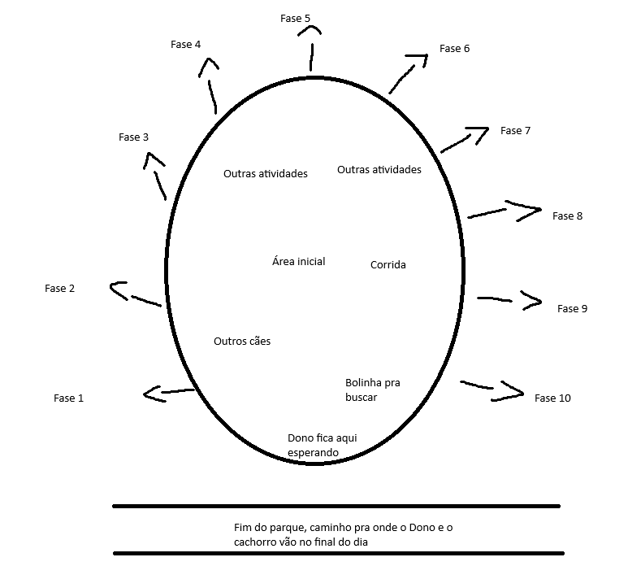

# Documento de design

O que decidimos nas conversas de outubro de 2026, depois da análise crítica do jogo. Este
arquivo manda sobre o design; o [CONCEITO.md](../CONCEITO.md) guarda a ideia original e o
[ROADMAP.md](../ROADMAP.md) diz o que falta programar. Nada daqui foi codificado ainda.

Marcações: **Decidido** é o que o autor confirmou; *Proposta* é sugestão ainda sem resposta;
*Em aberto* é o que falta pensar.

## 1. Visão

- **O jogo é uma antologia das vidas dos cães.** Cada capítulo é um cachorro, um humano e um
  lugar, contados em dias. O fio que une tudo é o **vínculo entre o cão e o seu humano**: cada
  capítulo termina num momento dos dois juntos.
- **Público**: quem gosta de puzzle, quem gosta de jogo aconchegante e, acima de tudo, quem
  ama cachorros. O puzzle dá o desafio; o carinho é o motivo de jogar.
- **Objetivo**: lançar na Steam um jogo divertido, que se pague. Projeto de hobby, com poucas
  horas por semana, então o escopo é decidido por isso.
- **Lançamento** (Decidido):
  - **Demo ou acesso antecipado**: a área central do parque e os dias 1 a 3.
  - **Lançamento**: os 10 dias do Parque e a Fazenda na neve. Se o escopo crescer demais, a
    Neve e as outras histórias viram outros jogos ou DLCs.
  - **Extras**: roupinhas e pelagens liberadas por conquistas.

## 2. Regras gerais de design

### Câmera
- **Decidido: só terceira pessoa.** Sai a câmera isométrica e, com ela, a troca de
  perspectiva: o mirante, a *Visibilidade* (só isométrico / só 3D), as tampas de folhagem do
  túnel e o aviso "Nova perspectiva!". *Feito*; a vista isométrica ficou só no editor de fases.
- Cuidados: o graveto atravessado não pode brigar com a câmera em corredores estreitos, e o
  jogador precisa enxergar o puzzle (a câmera recua em pontos-chave, ou o cachorro senta e o
  jogador olha em volta).

### Textos e dicas
- **Nenhum texto ensina a solução.** Os textos de dica atuais (`ZonaDica`) e os nomes de fase
  que entregam a mecânica ("Contrapeso", "Tronco rola", "Gelo liso") saem. *Feito* nas fases
  (a `ZonaDica` ficou para as cenas de teste).
- **Diálogo dá personalidade**: o personagem diz o que sente ou dá uma pista do caminho, nunca
  o que fazer. Frases curtas e poucas (cada uma é uma tradução a mais).
- **Cães falam por balões** a partir do latido; **humanos murmuram** (um som simples, como em
  outros jogos), sem voz gravada.
- **Prompts sem texto**: só o ícone da tecla ou botão, sempre igual.
- **Dica do dono**: travado por um tempo, o jogador ouve o dono assobiar ou chamar; o som vem
  da direção do caminho e o cachorro levanta as orelhas e vira a cabeça para lá.
- *Proposta*: o **faro** (farejar mostra rastros de cheiro no ar) como mecânica e dica sem
  texto ao mesmo tempo.

### Ações
- **Ações de contexto** ("presets") para atravessar e para os momentos bonitos: pular as
  pedras do córrego, pular dentro da moita, rastejar sob um tronco. Aperta o botão e o
  cachorro faz a animação.
- **Controle manual para resolver puzzles**, para o jogador nunca sentir que o jogo resolveu
  por ele.
- **Ação de força**: apertar o botão repetidamente para puxar algo com a boca ou cavar; parou
  de apertar, recomeça.

### Falhas, tempo e tensão
- **Falhas naturais**: ninguém morre e ninguém perde progresso. Errou o pulo, cai no córrego,
  sai sacudindo e volta para a margem.
- **Sem cronômetro e sem medidor de sobrevivência.** O frio, na Neve, é motivo da história
  (levar as ovelhas ao celeiro antes da nevasca), não uma barrinha caindo.
- Animais assustadores (o urso) causam tensão, nunca ameaça de machucar.

### Mecânicas
- **Foco em obstáculos naturais e animais.** Cada animal reage sempre do mesmo jeito, para o
  jogador aprender a regra e combinar.
- Animal é o conteúdo mais caro (modelo, animação, comportamento): poucos por capítulo, bem
  feitos.
- Veredito das fases de teste atuais (a esteira F01–F33 e N01–N10):

| Fica (natural) | Adapta | Sai |
|---|---|---|
| andar, pular, degrau alto (F01, F03, F05) | rampas e escada viram barranco e trilha (F04) | placas de madeira e de pedra (F15, F16) |
| rampa lisa vira barranco de lama (F06) | ponte vira tronco sobre o riacho (F07) | regra E e portão com atraso (F17, F18) |
| tábua e pinguela, equilíbrio (F08) | empurrar e puxar: o bloco vira pedra ou tronco (F13, F14) | alavanca e comporta (F19, F22) |
| correnteza e vau (F09) | ponte que cai e que cede viram galho e tronco podres (F20, F21) | perspectiva e mirante (F02) |
| cavar, cerca, enterrado (F10–F12) | portinhola vira buraco na cerca ou na sebe (F24) | cão vizinho (F28) |
| passarinho, esquilo, dono cochilando (F25, F27, F29) | contrapeso com passarinho, sem placa (F26) | |
| tronco que rola, gira e boia (F30–F32) | toca: não é central, talvez caminho secreto (F23) | |
| tempestade (F33) | | |
| neve fofa, gelo, gelo liso, monte de neve, vento (N01–N04, N08) | fogo: fica, com o senhor acendendo (N05–N07) | medidor de frio |
| pastoreio e celeiro (N09, N10) | | |

O código das peças que saem pode ficar até decidirmos apagá-lo; só não entram nas fases novas.

### Nome
- **Decidido: o nome muda.** "Weiner" está escrito errado (o certo é *wiener*) e *wiener* tem
  duplo sentido em inglês. Pode mudar completamente, já que o jogo virou uma antologia.
- *Proposta*: um nome sobre cachorros em geral, que funcione em inglês e português, com o
  capítulo no subtítulo ("‹Nome›: O Parque"), o que abre espaço para continuações e DLCs.
  Ideias soltas: *Walkies*, *Fetch*, *The Legendary Stick*, *Faro*/*Sniff*. Antes de decidir,
  checar a Steam e o registro de marca.

### Menu
- **Decidido: menu novo e original** (o atual lembra muito o Minecraft).
- *Proposta*: o menu dentro do mundo: a casa do salsicha, ele dormindo na caminha, a parede
  com os gravetos lendários; as opções são objetos (a coleira é *Jogar*, o mapa na geladeira
  é *Fases*, o pote de ração é *Opções*).

### Direção de arte
- **Decidido: o visual pode mudar todo**: mais orgânico, com curvas, árvores com volume, luz
  bonita.
- *Proposta*: **estilizado suave** em vez de realista. Realismo é o caminho mais caro, envelhece
  pior e um cachorro realista que se mexe estranho incomoda quem ama cachorros. Referências:
  *Little Kitty, Big City* (a mais próxima), *Lil Gator Game*, *A Short Hike*; *Stray* como
  exemplo do custo do realismo.
- *Em aberto*: as referências visuais do autor e a escolha da direção.

### IA de imagem e o caminho até o jogo
- A IA gera **conceitos 2D**, não modelos do jogo. Serve para paleta, luz, clima, menu, logo e
  o visual do cachorro.
- Plano: juntar 20 a 30 referências de graça e separar em 2 ou 3 direções; assinar **um mês**
  (sem plano anual) quando houver tempo para usar; explorar barato em volume e refinar a
  direção escolhida; fechar um *style kit* e uma bíblia visual (paleta, formas, luz, o cachorro
  de frente, de lado e de costas).
- Preços consultados em outubro de 2026 (Artlist, que atende pelo conector "Midjourney"):
  plano AI Starter, US$ 19,99/mês por 16.500 créditos que expiram no mês; uma imagem custa
  ~30 créditos (Flux 2.0 Flash 1K), ~100 (Seedream 5.0 2K) ou ~130 (Nano Banana 2 2K).
- Do conceito ao 3D: pacotes de assets gratuitos (natureza estilizada), a geração 3D do
  conector (precisa de limpeza e não vem com esqueleto) e um **freelancer para o cachorro**,
  que é o asset mais importante.
- A Steam exige declarar conteúdo gerado por IA, e parte do público aconchegante rejeita. Usar
  IA só como conceito é o caminho mais seguro.

## 3. Capítulo 1 — O Parque (o salsicha e o dono)

**Premissa**: os vários dias de um dono levando o seu salsicha para passear no parque. A cada
dia o cachorro encontra um graveto lendário e vai atrás dele. No fim do capítulo vemos os dois
em casa e descobrimos, comicamente, que o salsicha é um pequeno acumulador: a casa tem a
coleção de gravetos lendários de todos os dias.

### O mapa: área central e 10 regiões

- O parque é **um mapa só**. No meio, uma **área central** aberta (o "lobby"); em volta dela,
  **10 regiões**, uma por dia, cada uma pouco mais adiante da anterior. Embaixo, a saída do
  parque, por onde o dono e o cachorro vão embora no fim do dia.
- O **dono espera num banco** na beira da área central.
- As regiões se abrem pelo **número de gravetos lendários** já encontrados. As futuras podem
  estar à vista, mas um **bloqueio natural** impede de avançar além do começo: um tronco
  caído, um urso grunhindo e assustando o cachorro, a correnteza por cima das pedras no dia de
  chuva.
- Cada região tem um **marco distinto** (na entrada ou no meio) para o jogador lembrar onde ela
  fica e saber para onde voltar.

### A área central

Atividades casuais só para divertir, entrando das mais baratas para as mais caras:

| Atividade | Custo | Quando |
|---|---|---|
| Rolar na grama, deitar no sol, se sacudir | baixo (só animação) | primeiro |
| Buscar a bolinha com o dono | baixo | primeiro |
| Pular em poças e brincar na lama (dia de chuva) | médio | depois |
| Corrida | médio | depois |
| Brincar com outros cães | alto (comportamento) | depois |

- Desde o começo há **alguns cães e donos** passeando, para dar vida. Os personagens que
  ajudamos nas fases (o esquilo, o cão da corrida, o cão que reencontrou o dono...) **passam
  a aparecer** na área central: o progresso vira vida no parque.

### O ciclo de um dia

1. O dono brinca com o cachorro, tira a coleira e senta no banco. Uma frase curta, que muda a
   cada dia ("Vai lá, garotão, pode brincar").
2. O cachorro olha em volta e repara no que mudou: a região nova se abriu, ou um animal correu
   para dentro do mato naquele lado.
3. Brincar na área central à vontade.
4. Entrar na região do dia: a **ida**, até o graveto lendário.
5. Pegou o graveto: o **dono assobia** chamando para ir embora.
6. A **volta**, com o graveto na boca. Joga-se a parte interessante; um *fade* corta um pedaço
   do retorno e a cena volta com o cachorro chegando ao dono.
7. O dono põe a coleira e os dois vão para a saída do parque.
8. **O dia seguinte** pode trazer clima diferente, cães novos, atividades novas e roupinhas.

### Ida, volta e os gravetos

- A volta usa **o graveto do dia** de um jeito diferente a cada dia (menos no dia 1). Cada
  graveto tem forma e personalidade. Exemplo: uma **flauta** que alguém perdeu; mordida na
  vertical, o latido sai com um som engraçado.
- *Em aberto*: o graveto de cada dia.

### Missões secundárias

- Pequenos pedidos de quem encontramos: um cão que perdeu o brinquedo favorito, um dono
  perdido no mato, um cão que se perdeu do dono ("me perdi do meu dono porque corri atrás de
  uma borboleta").
- Elas podem mandar o jogador **de volta a fases anteriores**. Exemplo: "meu dono disse que
  queria muito achar uma flor especial, mas não sei onde procurar, você me ajuda a
  encontrá-lo?", e o jogador lembra do campo de flores de dois dias atrás, com uma flor bem
  diferente no alto que o cachorro cheira abanando o rabo; o dono deve estar lá.
- Um modelo só para todas (um personagem, um item ou lugar, duas falas), para sair barato.

### Personagens que voltam

- **Esquilo**: assusta-se no dia 1 e quebra o galho que vira o primeiro graveto; no dia 5
  ajudamos ele a pegar nozes.
- **Tartaruga**: no córrego, pular as pedras é uma ação de contexto e uma das "pedras" é a
  tartaruga. Ela afunda um pouco quando o cachorro passa, olha para ele e nada afundando para
  longe até sumir; sem ela, não dá para voltar por onde veio. *Em aberto*: em qual dia (não no
  3, para não ter três córregos seguidos).
- **Castores**: fazem a represa do dia 8, que cria a lagoa do dia 9.
- **Peixes-cuspidores**: cospem para derrubar frutas e insetos; o latido interage com eles.
- **Texugo**: perseguição brincalhona, lembrando o instinto do salsicha (*Dachs* é texugo em
  alemão; a raça foi criada para caçá-lo), sem ninguém se machucar.
- **Urso**: dá medo nos primeiros dias e no fim descobrimos que é amigável. Pistas dele antes:
  marcas de arranhão nas árvores, a pegada numa poça no dia de chuva, um dono que perdeu o
  cachorro porque o cachorro sentiu o cheiro da caverna do urso e foi atrás (dia 8, por
  exemplo).
- *No código*: os cinco animais novos já existem com movimento básico (passear, nadar, fugir,
  cuspir), sem lugar na história ainda (ver README, "Cavar, empurrar e bichos").
- **Easter eggs** com o capítulo 2: o border collie e o senhor passeando no parque; uma foto
  dos donos do salsicha na casa da fazenda.

### Os 10 dias (rascunho)

Só o dia 1 está detalhado; os outros são ideias para desenvolver.

1. **O primeiro graveto.** Passamos pela moita e saímos da área central, rodeados de mato e
   árvores. Rastejamos por baixo de um tronco semicaído. Ao longe, uma moita se mexe e chama
   a atenção. Pulamos algumas pedras num córrego (sem a tartaruga). Perto da moita, um botão e
   uma animação: o cachorro pula na moita e atravessa para uma pequena clareira, onde um
   esquilo põe uma noz na boca, vê o cachorro, se assusta e sobe numa árvore. Ao subir, quebra
   um galho, que cai iluminado pela luz da clareira e parece dourado, lendário, com um formato
   diferente (lembra um cajado). O cachorro pega, abanando o rabo, feliz. Ouve o dono
   assobiar e faz o caminho de volta com o graveto; um *fade* corta um pedaço do retorno e o
   cachorro chega ao dono, que põe a coleira, e os dois vão para a saída do parque.
2. **O córrego largo.** O jogador pode tentar pular fora das pedras e o cachorro sai da água
   se sacudindo. O córrego é mais largo e há um tronco comprido: subir nele e andar devagar
   para não desequilibrar. Do outro lado, cenas e interações novas.
3. *Em aberto*: algo sem córrego. Candidato: o texugo.
4. Cavar para passar por baixo de um tronco derrubado; ou ver um texugo e o cachorro, animado,
   correr atrás dele (dias 3 e 4 a decidir juntos).
5. **O esquilo de novo**: continuar a história do dia 1, ajudando o esquilo a pegar mais nozes.
6. **A corrida**: outro cachorro aparece em momentos da fase, indo na mesma direção, ou chama
   a atenção e tentamos alcançá-lo. Depois ele vira amigo na área central.
7. **Dia de chuva**: a área central ganha lama e poças para brincar; na fase, o córrego mais
   forte e várias interações com a água; o graveto lendário é levado pela correnteza e temos
   que alcançá-lo. A pegada do urso numa poça.
8. **Os castores**: chegar à represa e tirar o graveto lendário do topo dela. Apertos
   repetidos para puxar à força; parece que a represa vai quebrar, mas ela fica igual. Os
   castores ficam surpresos, depois aliviados e depois bravos, porque quase estragamos o
   trabalho deles. O graveto é um enfeite do topo: não quebra a represa (quebrar seria
   perigoso para o cachorro em cima dela e soltaria muita água).
9. **A lagoa**: a represa criou uma lagoa; os peixes-cuspidores interagem com frutas e
   insetos e reagem ao latido. Detalhes a definir.
10. **O final**: os animais dos dias anteriores voltam para ajudar; o urso se revela amigável.
    Depois, a casa e a parede com os gravetos.

### Outras ideias para encaixar
- Momentos sem puzzle no meio das fases: correr na grama, deitar no sol, cheirar flores.
- Um campo de flores e borboletas (liga com a missão do cão perdido).
- Uma fase de voltar para casa com o dono (o único lugar onde um cão vizinho faria sentido).

## 4. Capítulo 2 — A fazenda na neve (o border collie e o senhor)

- Um border collie vive numa fazenda com um senhor de idade e o ajuda a cuidar do rebanho:
  guia as ovelhas pelo caminho certo, afugenta outros animais, interage com os bichos da
  fazenda. Mostra o dia a dia dos dois.
- Exemplo de dia: uma ovelha se perdeu muito longe; o collie a encontra pelo faro e a traz de
  volta em segurança.
- Já existe no código: o border collie, as ovelhas, o pastoreio e o celeiro (N09, N10).
- **O fogo fica**, de um jeito natural, com o **senhor acendendo**. Ideias: o collie busca
  lenha e o senhor acende o fogão (eco do capítulo do salsicha: buscar gravetos, agora por
  trabalho); o lampião do senhor numa noite de nevasca, com o collie guiando a luz; o gelo na
  porta do celeiro que o senhor derrete com água quente.
- Feito depois do Parque.

## 5. Em aberto

- Nome do jogo, direção de arte e menu.
- O graveto de cada dia e os detalhes dos dias 2 a 10 (principalmente 3, 4 e 9).
- O dia da tartaruga.
- O faro como mecânica (proposta).
- Os dias da Fazenda na neve.
